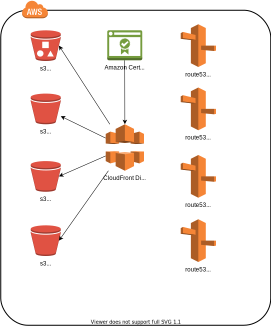

# Wichita (ISC)² Chapter

This project is used to manage the infrastructure as code (Terraform) which manages the infrastructure used to host:

- isc2ictchapter.org
- isc2wichitachapter.org
- isc2ictchapter.com
- isc2wichitachapter.com

Main details about the solution:

- An associated bucket 
- Web pages are stored in a single S3 bucket: s3://isc2wichitachapter.org.
- CloudFront is configured to serve the web pages from each of the 4 domains.
- CloudFront is configured to use Amazon Certificate Manager to deliver and update the x509 certificate used with SAN attributes for each of the domains.
- Route53 (DNS) is configured to point to CloudFront.

## Diagram
